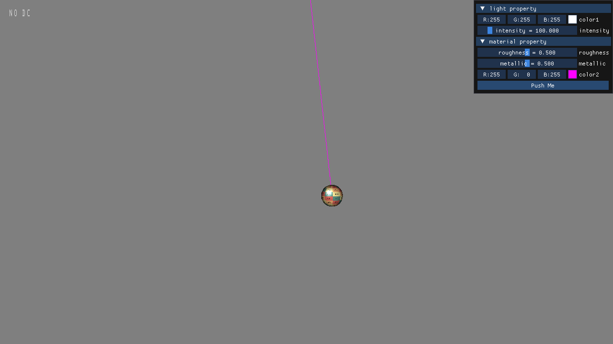

# blink

A simple 3d game engine base on vulkan and flecs. the main perporse of this project is used for me to practice and improve my vulkan API and ecs skills.

## features
- vulkan rendering system
- flecs integration, all update and rendering based on ecs system
- runtime shader reflection using spirv-cross (50%)
- rigidbody physics system base on ecs (10%)
- imgui integration
- glfw3, tinygltf, ...

## TODO
- multi-thread rendering
- multi-thread logic system update
- pbr material

